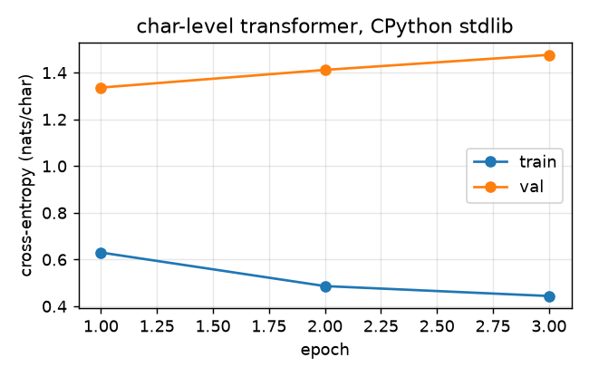
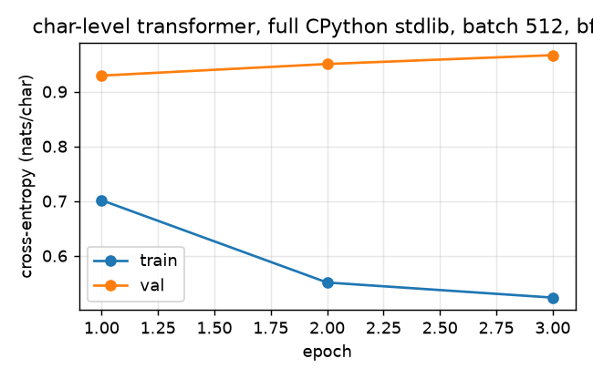

# Character-Level Transformer LM

A PyTorch-based character-level language model that learns from Python source code. Uses a decoder-only transformer architecture with causal self-attention.

Part of a "transistors to transformers" body of work; see also [mini-os32](https://github.com/Waelalzoub1/mini-os32), [custom-16bit-CPU](https://github.com/Waelalzoub1/custom-16bit-CPU), and [chess-rl](https://github.com/Waelalzoub1/chess-rl).

## Architecture

- **Tokenization**: Character-level (each unique character gets its own token)
- **Model**: Decoder-only transformer with causal masking, pre-norm LayerNorm, GELU activations, learned positional embeddings
- **Defaults**: 4 layers, 4 attention heads, d_model=256, context window of 256 characters

## Setup

```bash
pip install -r requirements.txt
```

## Usage

### 1. Prepare training data

Collect all `.py` files from a directory into a single text file:

```bash
python prepare_data.py /path/to/python/code -o dataset.txt
```

### 2. Train the model

```bash
python train.py --data dataset.txt
```

Training options:

| Flag | Default | Description |
|------|---------|-------------|
| `--epochs` | 50 | Number of training epochs |
| `--seed` | 1337 | Random seed |
| `--amp` | off | bfloat16 autocast on CUDA |
| `--batch-size` | 64 | Batch size |
| `--block-size` | 256 | Context window (characters) |
| `--d-model` | 256 | Embedding / hidden dimension |
| `--n-heads` | 4 | Number of attention heads |
| `--n-layers` | 4 | Number of transformer blocks |
| `--lr` | 3e-4 | Learning rate |
| `--dropout` | 0.1 | Dropout rate |
| `--save-dir` | `checkpoints/` | Where to save model checkpoints |

The best model (by validation loss) is saved to `checkpoints/best_model.pt`.

### 3. Generate text

Single prompt:

```bash
python inference.py --checkpoint checkpoints/best_model.pt --prompt "def hello"
```

Interactive mode:

```bash
python inference.py --checkpoint checkpoints/best_model.pt --interactive
```

Generation options:

| Flag | Default | Description |
|------|---------|-------------|
| `--max-tokens` | 500 | Maximum characters to generate |
| `--temperature` | 0.8 | Sampling temperature (lower = more deterministic) |
| `--top-k` | 50 | Top-k filtering (0 = disabled) |

## Results

Trained on this machine's CPython 3.14.6 standard library: the 154 top-level `Lib/*.py` modules, 4,723,742 characters, 180-character vocabulary, built with `prepare_data.py`. Hardware: one NVIDIA GeForce RTX 5080 (16 GB). Default configuration (4 layers, 4 heads, d_model 256, context 256, batch 64, AdamW 3e-4 with cosine decay, dropout 0.1), `--seed 1337`, **3 epochs instead of the default 50**: one epoch is 66,474 steps and takes 33 minutes, so 50 would take about 28 hours.

```bash
python prepare_data.py /usr/lib/python3.14 -o dataset.txt      # after copying the top-level .py files into a directory
python train.py --data dataset.txt --epochs 3 --seed 1337
```

| epoch | train loss | val loss | time | throughput |
|---|---|---|---|---|
| 1 | 0.630 | **1.336** | 32.9 min | 552 k tok/s |
| 2 | 0.486 | 1.412 | 32.6 min | 556 k tok/s |
| 3 | 0.444 | 1.476 | 31.9 min | 570 k tok/s |

Parameters: **3,317,428**. Best validation loss **1.336 nats/char** (epoch 1), 97 minutes total. Peak GPU memory about 3 GB.



The train/val gap opens immediately: every character offset is a training sample, so each 256-character window is seen many times per epoch, and the validation slice is the last 10 % of the alphabetically ordered files. Validation loss rises after epoch 1; more data helps more than more epochs.

Samples at temperature 0.8 (top-k 50), full text in [`docs/samples.md`](docs/samples.md):

```
def __init__(self, x, *bases):
        self.x = x
        self.set_seqs(x, level)

    # String representation for details.
```
```
import errno
import sys


try:
    from _ssl import functools import _ssl
except ImportError:
    _hashlib = None
```

### Run 2: full standard library, larger batch, bf16

Same model, `--batch-size 512 --amp` (bfloat16 autocast), on the whole standard library minus tests, idlelib, lib2to3 and site-packages: 604 files, 11,068,900 characters, 278-character vocabulary, 3,367,702 parameters, 3 epochs, seed 1337.

```bash
python train.py --data dataset_full.txt --epochs 3 --batch-size 512 --amp --seed 1337
```

| epoch | train loss | val loss | time | throughput |
|---|---|---|---|---|
| 1 | 0.702 | **0.929** | 52.4 min | 813 k tok/s |
| 2 | 0.551 | 0.951 | 52.4 min | 813 k tok/s |
| 3 | 0.524 | 0.967 | 52.4 min | 813 k tok/s |

Best validation loss **0.929 nats/char** (epoch 1), 2 h 37 min total, 11.6 GB GPU memory. Throughput only rose 1.5× despite the 8× larger batch and bf16, because the per-sample Python `DataLoader` (no workers, one tensor slice per item) is the bottleneck, not the GPU. More data lowered the validation loss from 1.34 to 0.93; again the best epoch is the first.



Run 2 sample at temperature 0.8 ([`docs/samples_run2.md`](docs/samples_run2.md)):

```
def __init__(self, x, y):
        self.x = x

    def __exit__(self, type, value, tb):
        self.traceback = traceback
        self.curframe = {}
```

## Tests

```bash
python tests/test_causal_mask.py
```

Three checks that the causal mask is correct: perturbing tokens after position t leaves logits at positions ≤ t unchanged, the logits of a prefix equal the corresponding logits of the full sequence, and no gradient flows from a loss at position t to embeddings after t.

## Project Structure

```
├── prepare_data.py   # Collects .py files into a training dataset
├── model.py          # CharTokenizer + CharTransformerLM definition
├── train.py          # Training loop with validation and checkpointing
├── inference.py      # Load a checkpoint and generate text
├── tests/test_causal_mask.py
├── docs/            # loss curve and samples
├── requirements.txt
└── README.md
```

## License

MIT
